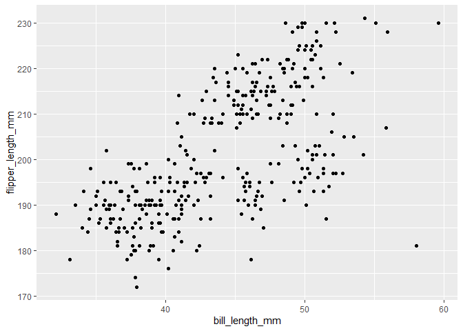

P8105 Homework 1
================
Jasmine Niu (jn2855)

``` r
library(tidyverse)
```

    ## ── Attaching packages ─────────────────────────────────────── tidyverse 1.3.2 ──
    ## ✔ ggplot2 3.3.6      ✔ purrr   0.3.4 
    ## ✔ tibble  3.1.8      ✔ dplyr   1.0.10
    ## ✔ tidyr   1.2.0      ✔ stringr 1.4.1 
    ## ✔ readr   2.1.2      ✔ forcats 0.5.2 
    ## ── Conflicts ────────────────────────────────────────── tidyverse_conflicts() ──
    ## ✖ dplyr::filter() masks stats::filter()
    ## ✖ dplyr::lag()    masks stats::lag()

## Problem 1

### Load the “penguins” dataset

``` r
data("penguins", package = "palmerpenguins")
```

### Write a short desciption of the “penguins” dataset

-   The dataset “penguins” have 344 samples. There are 8 variables in
    total: species, the island the each penguin lives on, the bill
    length, the bill depth, the flipper length, body mass, sex, and year
    (of their birth, I suppose).

-   The size of the dataset: there are 344 rows and 8 columns in this
    dataset.(Please refer to the R codes below.)

``` r
nrow(penguins)
```

    ## [1] 344

``` r
ncol(penguins)
```

    ## [1] 8

-   The mean flipper length is 200.9152 mm. (Please refer to the R codes
    below.)

``` r
mean(penguins$flipper_length_mm, na.rm = TRUE)
```

    ## [1] 200.9152

### Make a scatterplot and export my first scatterplot to my project directory

``` r
ggplot(penguins, aes(x = bill_length_mm, y = flipper_length_mm, color(species))) + geom_point()
```

    ## Warning: Removed 2 rows containing missing values (geom_point).

<!-- -->

``` r
ggsave("scatter_plot_hw1_jn2855.pdf", height = 4, width = 6)
```

    ## Warning: Removed 2 rows containing missing values (geom_point).
